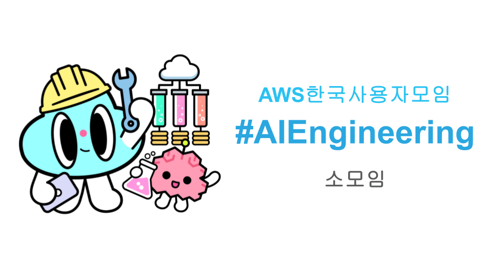

# AWSKRUG AIEngineering Group

AI 엔지니어링 소모임은 생성형 AI 시대에 새롭게 바뀌는 실제 개발 현장의 문제를 다루는 모임입니다. 클라우드 및 소프트웨어 엔지니어들이 꼭 알아두어야 하는 프롬프트 엔지니어링, 검색증강생성(RAG) 기법, 생성형 AI 개발 도구 및 활용법 등을 주로 다룹니다. 단, 대규모언어모델(LLM) 훈련 및 추론, 파인튜닝, GPU나 CUDA 활용, LLM MLOps와 관련된 주제는 다루지 않으며, 가급적 AWS 클라우드 내 Amazon Bedrock, Amazon Q Business, Amazon Q Developer 및 관련 벡터데이터베이스 (Amazon Aurora, OpenSearch 등) 서비스를 주로 다룹니다.

## Meetups

### AWSKRUG #AIEngineering 소모임 (2024년 10월 29일)
* 1부: Prompt Engineering & Bedrock Prompt Flows (장문기)
* 2부: Amazon Q Developer 소개 (윤평호)
* https://www.meetup.com/awskrug/events/303855587/

### AWSKRUG #AIEngineering 소모임 (2024년 9월 25일)
* 튜토리얼 - 생성형 AI 시대 새로운 엔지니어링 기법 (윤석찬)
* 사례발표 - AWSKRUG Gurumi 구현 방법 (유정열)
* https://www.meetup.com/awskrug/events/303205066/
