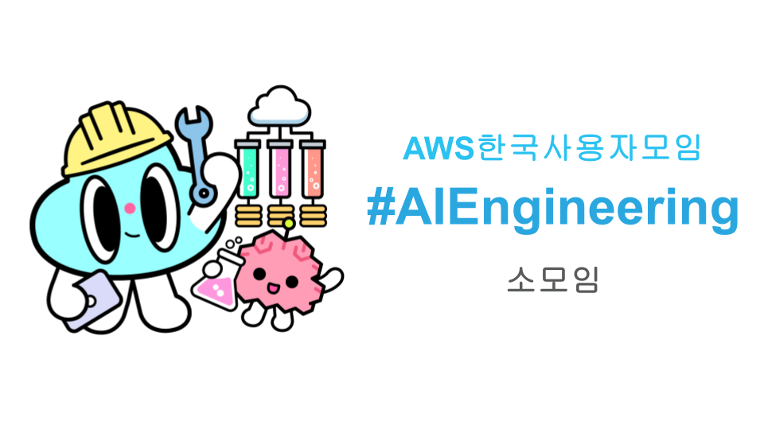

# AWSKRUG AIEngineering Group

## 소개 (Introduction)

AI 엔지니어링 소모임은 생성형 AI 시대에 새롭게 바뀌는 실제 개발 현장의 문제를 다루는 모임입니다. 클라우드 및 소프트웨어 엔지니어들이 꼭 알아두어야 하는 프롬프트 엔지니어링, 검색증강생성(RAG) 기법, 생성형 AI 개발 도구 및 활용법 등을 주로 다룹니다.

주요 활동 영역:
- 프롬프트 엔지니어링
- 검색증강생성(RAG) 기법
- 생성형 AI 개발 도구 및 활용법

주요 활용 기술:
- Amazon Bedrock
- Amazon Q Business
- Amazon Q Developer
- 관련 벡터데이터베이스 (Amazon Aurora, OpenSearch 등)

> 참고: 대규모언어모델(LLM) 훈련 및 추론, 파인튜닝, GPU나 CUDA 활용, LLM MLOps와 관련된 주제는 다루지 않습니다.

## 모임 기록 (Meetup History)

### 2026년 모임

#### 2026년 4월 - AWS 환경에서 비디오 인텔리전스 구현하기
* **날짜**: 2026년 4월 9일
* **모임 링크**: [Meetup](https://www.meetup.com/awskrug/events/313831600/)
* **발표내용**:
  * **AWS 환경에서 비디오 인텔리전스 구현하기 (경태훈, 이석원, 렌용저, AWS SA)**
    * 이론 세션 (30분): AWS 서비스 기반 분석 파이프라인 구축, 벡터 비교 및 임베딩 전략 소개
    * 핸즈온 워크샵 (1시간): 에이전트가 스스로 판단하고 도구를 선택하여 영상을 분석하는 에이전틱(Agentic) 비디오 엔진 구축 방법

#### 2026년 3월 - Bedrock AgentCore Hands-On
* **날짜**: 2026년 3월 4일
* **모임 링크**: [Meetup](https://www.meetup.com/awskrug/events/313428635/)
* **발표내용**:
  * **세션1 - Bedrock AgentCore Gateway로 PII 마스킹 및 세분화된 접근 제어 구현하기 (김수민, Cloud Support Engineer)** [실습자료](./src/20260304-Bedrock-AgentCore-Hands-On/bedrock-agentcore-gateway/)
  * **세션2 - AgentCore 에피소드 메모리로 학습하는 에이전트 구현해보기 (김다연, Cloud Support Associate)** [실습자료](./src/20260304-Bedrock-AgentCore-Hands-On/bedrock-agentcore-memory/)
  * **세션3 - Amazon Bedrock Code Interpreter로 만드는 정확하고 효율적인 AI Agent (이희찬, Cloud Support Engineer)** [실습자료](./src/20260304-Bedrock-AgentCore-Hands-On/bedrock-agentcore-code-interpreter/)

#### 2026년 1월 - Frontier Agent
* **날짜**: 2026년 1월 28일
* **모임 링크**: [Meetup](https://www.meetup.com/awskrug/events/312892561/)
* **발표내용**:
  * **프론티어 에이전트와 Kiro Autonomous Agent 알아보기  (최용호, AWS 테크에반젤리스트)** [발표자료](./docs/20260128_AWSKRUG_AIEngineering_Frontier%20Agent_YonghoChoi.pdf)
  * **AWS DevOps Agent와 Security Agent 알아보기  (신재현, 우아한형제들, AWS Hero)**

### 2025년 모임

#### 2025년 12월 - AWSKRUG 와 함께 하는 AI IDE #Kiro Launch Party 🎉 + 송년회
* **날짜**: 2025년 12월 11일
* **모임 링크**: [Meetup](https://www.meetup.com/awskrug/events/312206508/)
* **발표내용**:
  * (강연세션) Kiro 소개 : AI 코딩 도구 Kiro에 대한 데모 및 최신 기능 소개
  * (네트워킹) 연말 송년회

#### 2025년 11월
- Amazon OpenSearch 검색과 벡터 이야기 (조인트 모임)
* **날짜**: 2025년 11월 4일
* **모임 링크**: [Meetup](https://www.meetup.com/awskrug/events/311628454/)
* **발표내용**:
  * **OpenSearch의 개발 방향성과 운영 방향  (Dotan Horovits)**
  * 네트워킹

- 최신 AWS Agentic AI로 리뷰 관리 자동화 개발! (실습)
* **날짜**: 2025년 11월 25일
* **모임 링크**: [Meetup](https://www.meetup.com/awskrug/events/311988291/)
* **발표내용**:
  * **Strands Agents로 Review Agent 개발하고, Bedrock AgentCore에 배포하기  (장문기)**

#### 2025년 10월 - 해커톤 수상자들이 밝히는 Q Developer 활용 비법
* **날짜**: 2025년 10월 16일
* **모임 링크**: [Meetup](https://www.meetup.com/awskrug/events/311164557/)
* **발표내용**:
  * **[AI랑 채팅만 했는데 앱이 나왔다(Kiro 해커톤 참여기)](docs/251016-GoNow_SmartDepartureSystem_BuiltWithAIChat.pdf)  (신종한)**
  * **[AI 에이전트와 함께 뛰어난 블록코딩 개발자 되기!](docs/251016-TopBlockCodingWithAIAgents.pdf)  (이원준)**
  * **[Amazon Q와 Amazon Nova 모델들을 활용한 이틀만의 영어 회화 서비스 개발기(Amazon Q 해커톤 비하인드)](docs/251016-QDevHackathon2025_AmazonNova_EnglishLearning.pdf)  (이은지)**

#### 2025년 9월 - Bedrock Multi-agents Hands-on Lab (실습)
* **날짜**: 2025년 9월 17일
* **모임 링크**: [Meetup](https://www.meetup.com/awskrug/events/310847074/)
* **발표내용**:
  * **Bedrock Multi-agents Hands-on Lab  (윤평호, AWS 커뮤니티 빌더, mosesyoon)** [발표자료/Workshop Studio](https://catalog.us-east-1.prod.workshops.aws/workshops/c68a2fb4-8b25-480f-ab0b-129778f96d4d/ko-KR)

#### 2025년 8월 - Kiro Hands-on Lab (실습)
* **날짜**: 2025년 8월 21일
* **모임 링크**: [Meetup](https://www.meetup.com/awskrug/events/310381376)
* **발표내용**:
  * **Spirit of Kiro  (김성한, AWS)** [발표자료](docs/20250821_AWSKRUG_AIENG_KIRO.pdf), [발표자료/Workshop Studio](https://catalog.us-east-1.prod.workshops.aws/workshops/fa7d6664-d74e-4362-9042-bd9f4579d685/ko-KR)

#### 2025년 7월 - 나만의 서버리스 GenAI 앱 구축하기 Hands-on Labs (실습)
* **날짜**: 2025년 7월 23일
* **모임 링크**: [Meetup](https://www.meetup.com/awskrug/events/308422293/)
* **발표내용**:
  * **로우코드/노코드로 서버리스 Agentic AI 애플리케이션 빠르게 구축하기  (조현우, AWS)** [발표자료](docs/20250723%20AWSKRUG%20-%20GenAI%20Workshop.pdf), [발표자료/Workshop Studio](https://catalog.us-east-1.prod.workshops.aws/workshops/c8b1983a-a259-462e-bd9e-065668e6ea50/ko-KR)

#### 2025년 6월 - MCP on AWS: Hands-on Lab (실습)
* **날짜**: 2025년 6월 4일
* **모임 링크**: [Meetup](https://www.meetup.com/awskrug/events/307856695/)
* **발표내용**:
  * **MCP on AWS: Hands-on Lab  (신정섭, AWS)** [발표자료/Workshop Studio](https://catalog.us-east-1.prod.workshops.aws/workshops/4bfd0cd5-45d4-4183-ab13-6992de68d888/ko-KR)

#### 2025년 5월 - MCP on AWS
* **날짜**: 2025년 5월 7일
* **모임 링크**: [Meetup](https://www.meetup.com/awskrug/events/307266851/)
* **발표내용**:
  * **MCP on AWS  (윤평호, AWS 커뮤니티 빌더, mosesyoon)** [발표자료](https://docs.google.com/presentation/d/e/2PACX-1vQZq0IzZa3eiDlZW5QtshlVLExMBwAucA1PMWr1VRNUCk5wV8JncjIewDdbRqayqE_33LnQLkuWVu4W/pub?slide=id.g3538d9b3fb8_2_228)

#### 2025년 4월 - Amazon Q Dev CLI를 이용한 바이브 코딩 (실습)
* **날짜**: 2025년 4월 9일
* **모임 링크**: [Meetup](https://www.meetup.com/awskrug/events/306928642/)
* **발표내용**:
  * **Amazon Q Developer CLI와 함께하는 바이브코딩  (윤석찬, channy)** [발표자료](./docs/202504-VibeCoding-Q-CLI.pdf)

#### 2025년 3월 - 프롬프트 엔지니어링 핸즈온
* **날짜**: 2025년 3월 13일
* **모임 링크**: [Meetup](https://www.meetup.com/awskrug/events/306528634/)
* **발표내용**:
  * **Anthropic Claude v3 프롬프트 엔지니어링 핸즈온  (유정열, nalbam)** [발표자료/Workshop Studio](https://catalog.workshops.aws/prompt-eng-claude3/ko-KR)

#### 2025년 1월 - Chat Driven Development
* **날짜**: 2025년 1월 22일
* **모임 링크**: [Meetup](https://www.meetup.com/awskrug/events/305372486/)
* **발표내용**:
  * **Chat Driven Development  (정도현)**: Windsurf IDE를 사용해서 라이브 코딩을 진행하며, 최신 GenAI 개발 도구와 서버리스 아키텍처를 이용해 사이드 프로젝트를 효과적으로 수행하는 방법에 대한 노하우 공유. [데모 리포](https://github.com/awskrug/aiengineering-demo)

### 2024년 모임

#### 2024년 12월 - AWS re:Invent 2024 re:Cap
* **날짜**: 2024년 12월 17일
* **모임 링크**: [Meetup](https://www.meetup.com/awskrug/events/304519465/)
* **발표내용**:
  * **AWS re:Invent 2024 re:Cap - Bedrock  (장문기)** [발표자료](https://drive.google.com/file/d/1WuoOpuiM34URwqkYNIkZhqsqNyL4jSrv/view?usp=sharing)
  * **AWS re:Invent 2024 re:Cap - Q Developer  (김현민)** [발표자료](https://drive.google.com/file/d/1VtwIJ4AfrTYG2yUe0WGdWlyK-wRsM8UC/view?usp=sharing)
* **참고자료**:
  * [Amazon Q Deverloper Session](https://lilys.ai/collections/20141)
  * [Amazon Bedrock Session](https://lilys.ai/collections/21363)

#### 2024년 10월 - Prompt Engineering & Bedrock Prompt Flows
* **날짜**: 2024년 10월 29일
* **모임 링크**: [Meetup](https://www.meetup.com/awskrug/events/303855587/)
* **발표내용**:
  * **Prompt Engineering & Bedrock Prompt Flows  (장문기)** [발표자료](./docs/241029-Prompt-Engineering-and-Bedrock-Prompt-Flows.pdf)
  * **Amazon Q Developer 소개  (윤평호, AWS 커뮤니티 빌더, mosesyoon)** [발표자료](./docs//241029-AmazonQDeveloper_AIPairProgramming.pdf)

#### 2024년 9월 - 생성형 AI 시대 새로운 엔지니어링 기법
* **날짜**: 2024년 9월 25일
* **모임 링크**: [Meetup](https://www.meetup.com/awskrug/events/303205066/)
* **발표내용**:
  * **튜토리얼 - 생성형 AI 시대 새로운 엔지니어링 기법  (윤석찬)** [발표자료](./docs/240925-AI-Engineering.pdf)
  * **사례발표 - AWSKRUG Gurumi 구현 방법  (유정열)**: [발표자료](./docs/240925-Gurumi-Bot-with-RAG.pdf)

## 참여 방법

AWSKRUG AIEngineering 소모임은 [AWSKRUG Meetup](https://www.meetup.com/awskrug/)을 통해 정기적으로 모임을 개최합니다. 관심 있는 분들은 Meetup 페이지에서 가입하고 이벤트 알림을 받아보세요.

## 자료 및 리소스

모든 발표 자료와 관련 리소스는 이 저장소에서 확인할 수 있습니다. 발표 자료는 `docs` 디렉토리에 저장되어 있으며, 추가 리소스 및 데모 프로젝트는 발표자의 GitHub 페이지나 연결된 리소스를 참조하세요.
