# 실습 준비
1. SageMaker AI Notebook Instance 생성
2. SageMaker AI Notebook Instance Execution Role
3. Cloudwatch Transaction Search 활성화
4. Bedrock Agentcore Memory 실습 미리 수행

---
#### 1. 전달받으신 링크에 접속 후 왼쪽 메뉴바에서 AWS account access > Open AWS console을 클릭합니다.
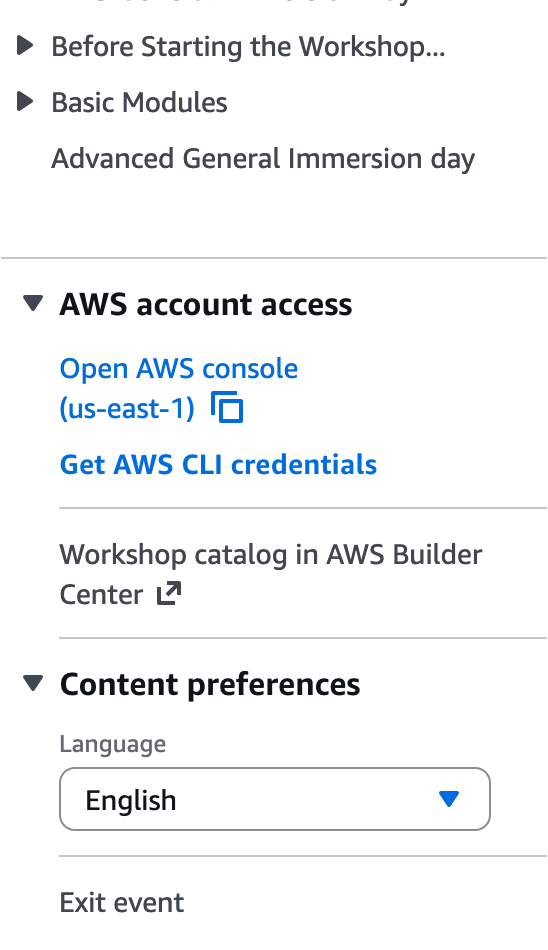

#### 2. 먼저 SageMaker AI 서비스에서 오늘 실습을 진행할 Notebook Instance를 생성해봅시다.
상단 검색창에 SageMaker AI 검색 > 왼쪽 메뉴바에서 Applications and IDEs > Notebooks

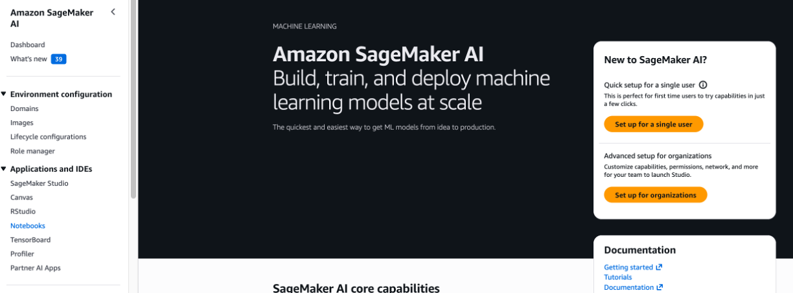

#### 3. Create notebook Instance버튼을 클릭합니다.

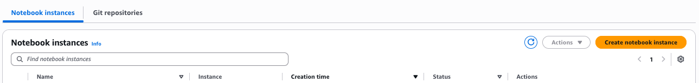

#### 4. Create notebook instance – 기본 설정

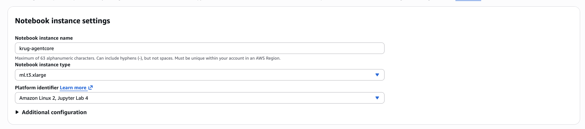
- Notebook instance name: krug-agentcore
- Notebook instance type: t3.xlarge
- Platform identifier: Amazon Linux 2, Jupyter Lab 4

#### 5. Create notebook instance – Permissions and encryption

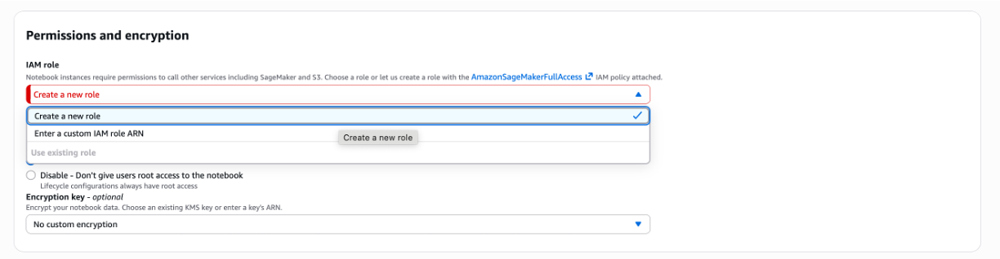
- IAM role: create a new role
- 그 외 설정은 기본값 그대로

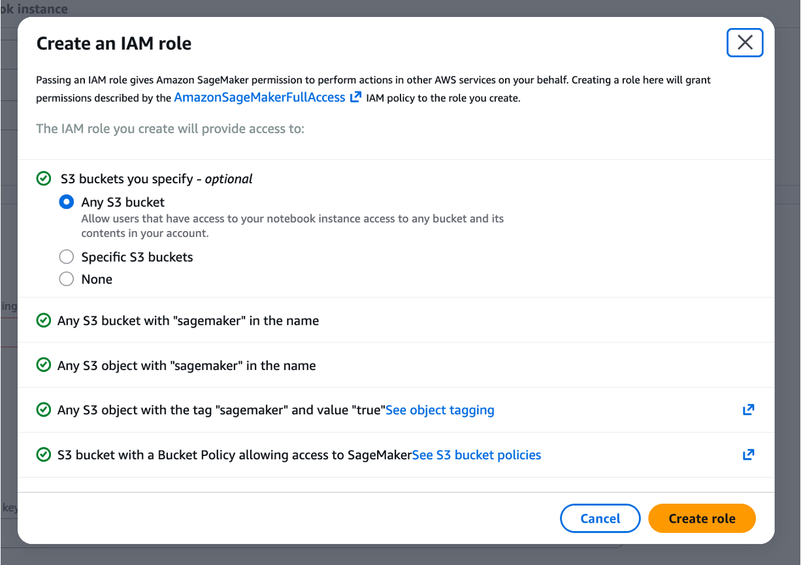

#### 6. Create notebook instance – Git repositories

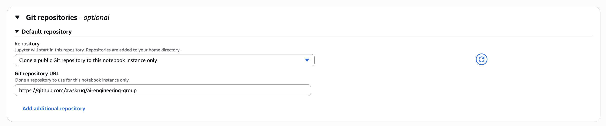

- Default repository
  - Repository: Clone a pulic Git repository to this notebook instance only
  - Git repository URL: https://github.com/awskrug/ai-engineering-group

#### 7. Notebook 인스턴스가 준비되는 동안 Notebook Instance의 Execution Role을 수정합니다.

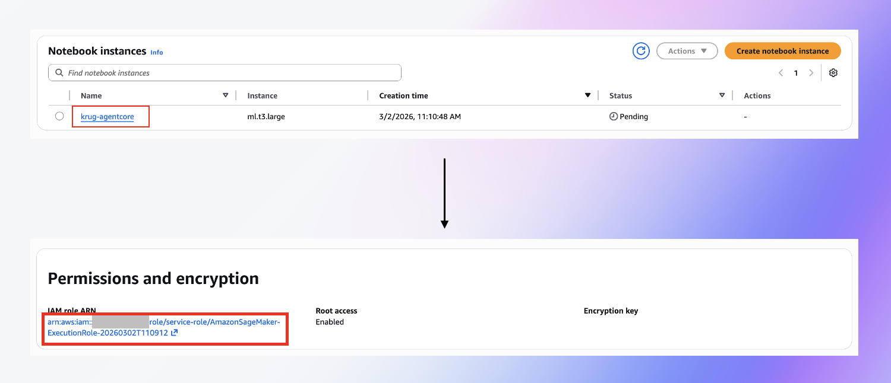

#### 8. Execution Role에 AdministratorAccess 정책을 추가합니다.
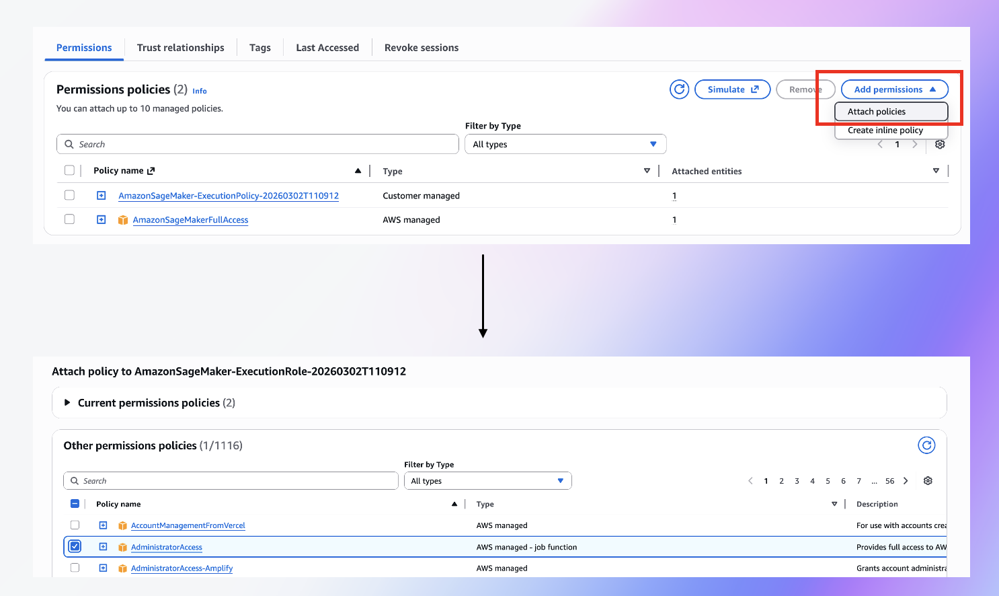

#### 9. Cloudwatch > Transaction Search 서비스로 가서 Transaction Search를 활성화합니다.

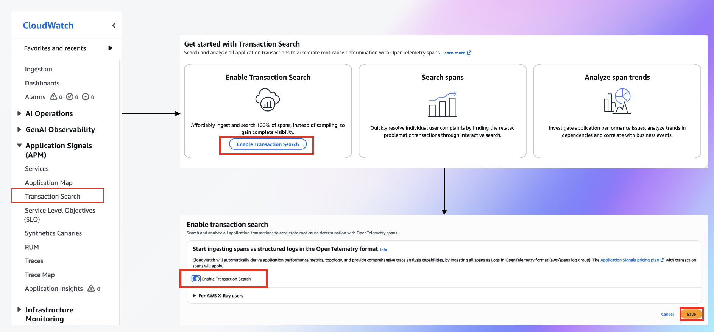

#### 10. SageMaker Notebook Instance의 상태가 InService가 되면 Open Jupyter 또는 Open JupyterLab을 클릭하여 접속합니다.
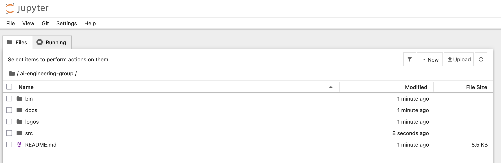

#### 11. src/20260304-Bedrock-AgentCore-Hands-On 폴더로 이동합니다.
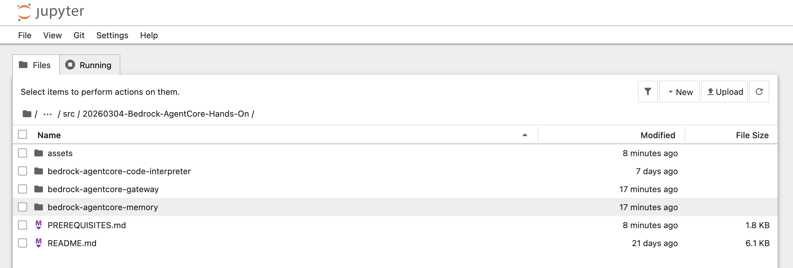

#### 12. bedrock-agentcore-memory/01-hands-on/math-teacher-agent.ipynb파일을 열어줍니다.
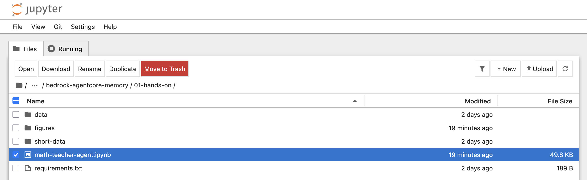

#### 13. 커널은 기본 conda_python3를 선택합니다.
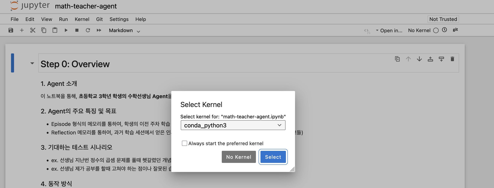

#### 14. 상단 Run > Run All Cells 버튼을 클릭합니다.
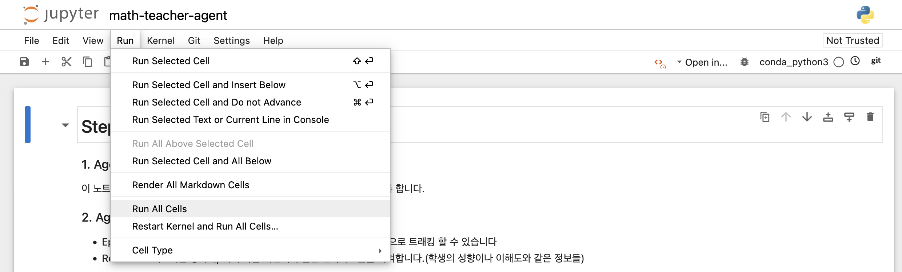